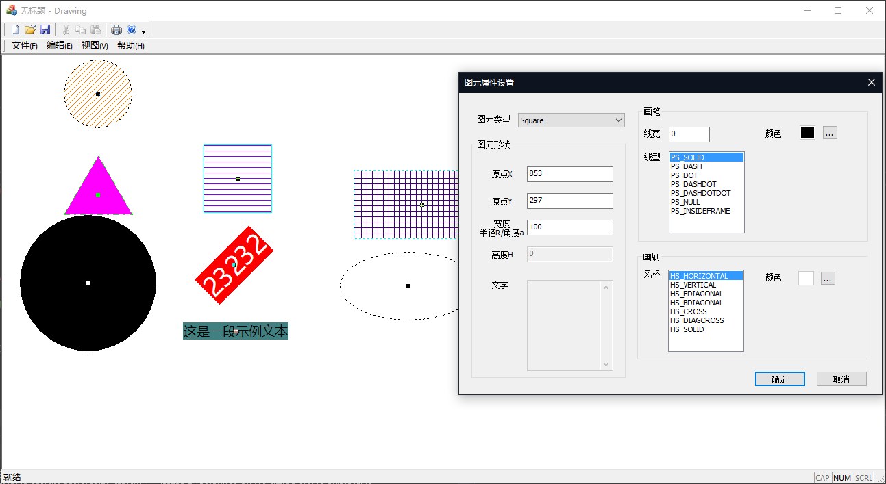
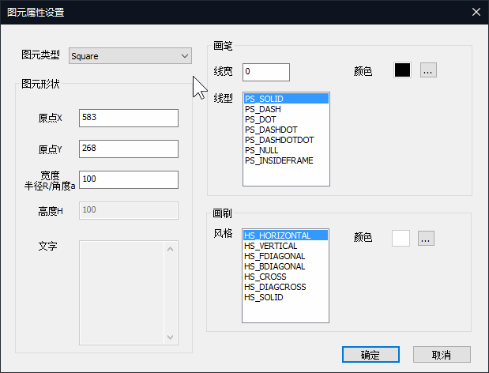

# Drawing

> 使用失传的MFC技术编写的简易画板——计科专业课程设计作业

## Features

### 支持绘制的图元及属性

所有可绘制图形（以下均简称图元）都支持：

- 绘制工作以图元原点为中心
- 可设置绘制位置
- 可设置边框颜色（对于*文本类型*是**字体颜色**）
- 可设置填充颜色（对于*文本类型*是**背景色**）

除*文本类型*以外，其他图元均支持绘制指定宽度的边框。

下面的特性是每种图元特有的：

- *正方形类型* - 可设置宽度（边长）

- *长方形类型* - 可设置宽度和高度

- *正三角形类型* - 可设置宽度（边长）

- *圆形类型* - 可设置宽度（半径）

- *椭圆类型* - 可设置宽度和高度

- *文字类型* - 可设置欲绘制的文本和旋转角度

### 新建图元

- 按住`Ctrl`+左键将弹出图元属性设置窗口
- 默认将以*正方形类型*作为选中的图元类型
- 鼠标点击点将作为默认的图元原点

### 修改图元

- 左键双击将弹出图元属性设置窗口
- 修改图元类型时，宽度（或半径，旋转角度）和高度以及文本内容属性可能会被修改至推荐值
- 宽度（或半径，旋转角度）和高度以及文本内容属性设置是独立的。  
  在切换图元类型时，当前对话框会根据不同的图元类型为上述属性提供独立的值。

### 删除图元

- 右键双击将直接删除鼠标点击点判定的**最上层图元**对象

### 保存与读取

- 所有图元类型继承于**CObject**
- 实现了序列化，因此可以保存和读取文档

## Known Bugs

- 对于可绘制指定宽度的边框的图元而言（即除了*文字类型*），若设置大于0的边框宽度，再更改边框类型，只有**PS_INSIDEFRAME**和**PS_NULL**这两种类型绘制效果与其他类型不同。

- 对于边框较厚的图元，鼠标点击判定可能会不准确。